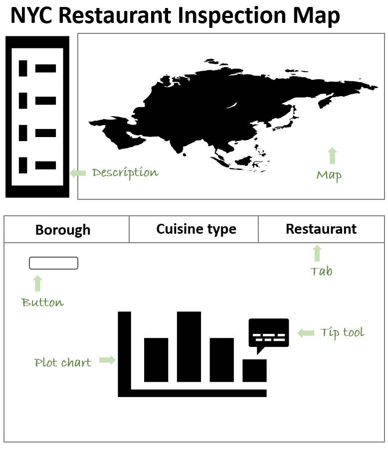

# NYC Restaurant Inspection Map

### Visualization App Purpose

The purpose of this visualization app is to provide an easy way for people to check the inspection results of restaurants in New York City (NYC). The full proposal can be found in the [proposal file](https://github.com/flizhou/NYC_restaurant_inspection_map/blob/master/proposal.md).

### App Description and Functionality

The landing page of the app has a map of restaurants in NYC in the top panel and three tabs in the bottom panel. In the map, each point represents a restaurant and is assigned a color based on the borough. Users can enlarge the map and hover a data point to view the corresponding restaurant information. In the bottom panel, the default view is the "Borough" tab, which contains two bar graphs of the restaurant grade distribution in different boroughs or of different cuisine types. There are five categories of grades, "A" (best), "B", "C", "P" (no grade yet), and "NA" (no inspection). A full discription of the grading rule can be foun [here](https://www1.nyc.gov/assets/doh/downloads/pdf/rii/inspection-cycle-overview.pdf). The dropdown menu is associated with the second bar plot. Users can choose or input a borough and view the restaurant grade distribution of the top 20 most common cuisine types in the selected borough. The "Cuisine type" panel has one bar graph of the restaurant grade distribution of given cuisine types. With the dropdown menu, users can select or input cuisine types and view the grades distribution of the selected cuisine types. The "Restaurant" panel shows a point-line graph of the selected restaurants' inspection results over time. With the dropdown menu, users can select or input restaurant names and view the inspection results from the selected restaurants.

### App sketch

### Contribution

We welcome all feedback and contributions. If you are interested in contributing to our app, please read my [contributing document](https://github.com/flizhou/NYC_restaurant_inspection_map/blob/master/CONTRIBUTING.md) and our [code of conduct](https://github.com/flizhou/NYC_restaurant_inspection_map/blob/master/CODE_OF_CONDUCT.md). Our [license](https://github.com/flizhou/NYC_restaurant_inspection_map/blob/master/LICENSE) outlines our permissions and copyright information for users.

### Creator

This GitHub repository was created by Fanli Zhou.